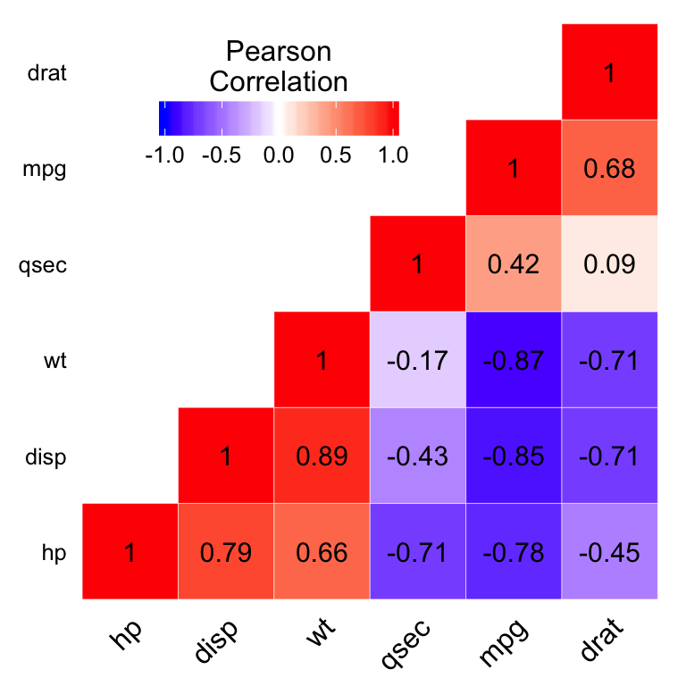

# Coorelation Webs for Exploratory Data Analysis
There are a lot of ways to visualize correlation. When you're only comparing two variables, the most common way is a simple scatter-plot. 

Using the famous "mtcars" data-set, let's make a scatter-plot of weight(wt) against miles per gallon (mpg).

```{r}
cars_df <- mtcars
ggplot(cars_df,aes(wt, mpg)) + geom_point(color="Steelblue",size=2)
```
While this "eyeball-it" approach has a certain appeal, it doesn't really allow us compare this correlation with others, so we'd like to be able to reduce correlation to a number. This  is easily done with R's `cor()` function.

```{r}
cor(cars_df$mpg,cars_df$wt)
```

That works fine for comparing two variables with each other, but what if we want to compare multiple variables to each other in an easy to digest manner. For that, we run `cor()` on the entire data-set, and get a correlation matrix.

```{r}
round(cor(cars_df),3)
```
Now we have all the information we need, but there are a few problems.

* It's easy for your eyes to get lost in the middle of the matrix. 
* Because correlations are reflexive, all of the results are given twice.
* If there were any perfect correlations, they wouldn't really jump out at us.

Perfect correlations are a problem with some machine learning algorithms, most commonly, linear regression. For example, if we had "kilometers per liter" as one of our variables, this would cause a "Singular Matrix" error if we tried to include both `mpg` and `kpl` as independent variables.

So ideally, we'd like this information to be conveyed in a visual plot from which information can easily be extracted. Traditionally, that's done with a heat map.

```{r}
ggplot(data = melt(cormat), aes(x=Var1, y=Var2, fill=value)) + 
  geom_tile()
```  
  
  This let's us take in information at a glance, but has the same limitations as the correlation matrix above.
  
  Of course, this could be cleaned up if we wanted to. By following the tutorial [here](http://www.sthda.com/english/wiki/ggplot2-quick-correlation-matrix-heatmap-r-software-and-data-visualization), we would be able to make a very clean looking plot that solves the above problems. 
  

  But let's see if we can find another way to visualize this information in a way that can be done easily with cleaned data-sets.

## My Solution
  So what if we used tools in R built for network analysis for the job? It seems like a good fit. After all, correlations are simply a measurement of the relationship between two variables.
  Let's go through the parts piece by piece. 
  
```{r}
library(network)
library(sna)
library(GGally)
library(tidyverse)
```

First, we'll need either a data-frame, or a data structure that can be coerced into a data-frame (such as a data.table or matrix). Then we need to restrict the data-frame that we'll be using to the numeric variables. Also, we'll replace the `carb` variable with kilometers per liter, `kpl`. You'll see why later.
```{r}
cars_df <- mtcars
cars_df$carb <- NULL
cars_df$kpl <- cars_df$mpg * 0.425144 #miles per gallon to kilometers per liter fomula
orig_df <- as.data.frame(cars_df)
num_df <- orig_df[,sapply(orig_df, is.numeric)]
num_df <- num_df[apply(!is.na(num_df), 1, any), ]
```

Then we'll need to set up the "nodes" (the variables) and the "edges" (the lines between the nodes). 

```{r}
node_count <- length(num_df)
edge_count <- (node_count-1)*node_count/2 #formula for edges between all nodes
node_labels <- colnames(num_df)
```

We'll also need to find all the correlations, and then set make sure that they are in the order than the `GGally` package expects.

```{r}
cor_df <- as.data.frame(cor(num_df))
up <- upper.tri(cor_df)
out <- data.frame(which(up, arr.ind=TRUE), cor=cor_df[up])
out <- out[!is.na(out$cor),]
out <- out[order(abs(out$row), decreasing=FALSE),]
```

Then the only thing that we need is to adjust is the size of the edges to show the correlations. The bigger the line, the greater the correlation.

Pay special attention to the formula, while remembering that the absolute value of correlation is between zero and one.

The constants `5` and `0.1` work well in the final plot, but we'll later allow these values to be adjusted.
```{r}
edge_size <- ((abs(out$cor)+1)^5)*0.1
```

Then the only thing left to do is plot it.
```{r}
net <- network(rgraph(node_count, mode = "graph", tprob = 1)
                 ,directed = FALSE)
  
#creates graph
print(ggnet2(
       net, 
       mode="circle",
       node.size = 10,
       label = node_labels, 
       edge.size = edge_size
         ))
```
And with that we could be done. But, it could use some tweaks. We'd probably like some color, and a way to toggle off variables.

Let's start with color for the nodes. We could do one of two things here. We could set all the nodes to be the same color, or we could create a gradient. For now, let's go with a gradient.
```{r}
node_colors = c("brown1","darkgoldenrod1","springgreen","royalblue")
colfunc<-colorRampPalette(node_colors)
```

Now on to the color of the lines. We want positive to be a blue color, and negatives to be a red color. We also want perfectly correlated variables to be a more vibrant color so that we take special note of them.

```{r}
pos_color <- "steelblue"
neg_color <- "salmon"
perf_pos_color <- "navy"
perf_neg_color <- "firebrick1"
```

And then we just need to adjust our plot to incorporate the new variables we've defined. Note the navy colored line that appears between `mpg` and `kpl`, the two perfectly correlated variables.
```{r}
  print(ggnet2(
         net, 
         mode="circle",
         node.size = 10,
         label = node_labels, 
         node.color = colfunc(node_count),
         edge.size = edge_size,
         edge.color = ifelse(out$cor == 1, perf_pos_color,
                     ifelse(out$cor == -1, perf_neg_color,
                     ifelse(out$cor>0, pos_color, neg_color)))
         ))
```
This looks pretty decent. The small lines, like the line between `mpg` and `qsec` denote a small correlation, and larger lines, like the line between `cyl`  and `mpg` denote high correlations.  
However, you may notice that this plot is a bit busy. If we had more variables, it might become hard to follow the lines. So, it would be nice if we could choose which variables to focus on, either by variable name or index.
```{r}
#allows column names to be used for show_cors
if(!is.numeric(show_cors)){
  show_cors <- which(colnames(num_df) %in% show_cors)}

out$show <- ifelse(!(out$row %in% show_cors| out$col %in% show_cors),0,1)
out<-out[order(abs(out$row), decreasing=FALSE),]
```

So now if we were most interested in the miles per gallon and horsepower variables, we could try the following.
```{r}
show_cors <- c(1,4) #or equililently: show_cors <- c('mpg','hp')

print(ggnet2(
         net, 
         mode="circle",
         node.size = 10,
         label = node_labels, 
         node.color = colfunc(node_count),
         edge.lty = out$show,
         edge.size = edge_size,
         edge.color = ifelse(out$cor == 1, perf_pos_color,
                     ifelse(out$cor == -1, perf_neg_color,
                     ifelse(out$cor>0, pos_color, neg_color)))
         ))

```

Great! All that's left now is to put all of these into a function, with some nice defaults, so that we can produce this plot with other cleaned data frames.


```{r}
coorelation_web <- function(
  orig_df,
  node_colors = c("brown1","darkgoldenrod1","springgreen","royalblue"),
  perf_pos_color = "navy",
  perf_neg_color = "firebrick1",
  pos_color = "steelblue",
  neg_color ="salmon",
  show_cors = c(1:length(as.data.frame(orig_df[,sapply(orig_df, is.numeric)]))),
  edge_sensitivity = 5,
  edge_multiple = .1,
  node_size = 15
  ){
    #restrict data frame to numeric columns
    orig_df <- as.data.frame(orig_df)
    num_df <- orig_df[,sapply(orig_df, is.numeric)]
    num_df <- num_df[apply(!is.na(num_df), 1, any), ]
    
    node_count <- length(num_df)
    edge_count <- (node_count-1)*node_count/2 #formula for edges between all nodes
    node_labels <- colnames(num_df)
    
    # allows column names to be used for show_cors
    if(!is.numeric(show_cors)){show_cors <- which(colnames(num_df) %in% show_cors)}
  
    #creates a gradient from the node colors
    colfunc<-colorRampPalette(node_colors)
    
    #lists out coorelations in proper order (ex: 12, 13, 14, 23, 24, 34)
    cor_df <- as.data.frame(cor(num_df))
    up <- upper.tri(cor_df)
    out <- data.frame(which(up, arr.ind=TRUE), cor=cor_df[up])
    out <- out[!is.na(out$cor),]
    
    #creates a column that defines which coorelations are shown, then sorts
    out$show <- ifelse(!(out$row %in% show_cors| out$col %in% show_cors),0,1)
    out<-out[order(abs(out$row), decreasing=FALSE),]
    
    #determine the width of the coorelation lines (edge_size)
    edge_size <- ((abs(out$cor)+1)^edge_sensitivity)*edge_multiple
  
    #sets up first graph parameter
    net <- network(rgraph(node_count, mode = "graph", tprob = 1)
                   ,directed = FALSE)
    
    #creates graph
    print(ggnet2(
           net, 
           mode="circle",
           node.size = node_size,
           label = node_labels, 
           node.color = colfunc(node_count),
           edge.lty = out$show,
           edge.size = edge_size,
           edge.color = ifelse(out$cor == 1, perf_pos_color,
                       ifelse(out$cor == -1, perf_neg_color,
                       ifelse(out$cor>0, pos_color, neg_color)))
           ))
}
  
```

#### To summarize:

* The width of the lines represent the correlation between the variables.
* The color of the liens represent a positive (blue) or negative (red) correlation.
* More vibrantly colored lines represent perfect correlation between two variables, meaning that one of them should be dropped for future analysis.

## Coorelation Web Examples

Changing the node color:
```{r}
coorelation_web(mtcars, node_colors = 'orange',show_cors = 'wt')
```
Changing the node size:
```{r}
coorelation_web(mtcars, show_cors = 1, node_size = 10)
```
Changing the relative sizes of the edges:
```{r}
coorelation_web(mtcars,edge_sensitivity = 6, edge_multiple = .15, show_cors = 'wt') 
```
Making a grey-scale version
```{r}
coorelation_web(mtcars, node_colors = 'azure4', pos_color = 'darkgrey',neg_color = 'black',show_cors = 'qsec')
```

## Regression Web

While that works well for EDA, with a few adjustments, we can use it to visualize Linear Regression parameters. In order to do that, we need to do the fit a linear regression, and then standardize the results.


Fitting a model is pretty easy in R. We'll use 'wt' (weight) as the dependent variable as an example. We also need to standardize the variables so that we can interpret the fitted coefficients as beta-weights.
```{r}
cars_df <- as.data.frame(scale(mtcars))
fit <- lm(wt~.,data=cars_df)
lm_df <- data.frame(fit[[1]])
colnames(lm_df) <- "param"
```
We want our parameters to be between -1 and 1, like our correlations above expects, so that the function creates correctly sized lines. So, we want to make sure that the *relative* values of our parameters remain the same, but are easy to visualize in our graph. That is easily done by dividing by the maximum value of the absolute value of the parameters.

```{r}
lm_df <- lm_df / max(abs(lm_df))
```

We'll make the y-intercept optional, for cases where it makes the differences between our other parameters difficult to determine.

It's important to note that omitting the y-intercept is *not* regression through the mean. The regression is performed as usual, but the intercept parameter is discarded before the graph is shown.

Lastly, we'll eliminate the perfect correlation colors, because they no longer have a special interpretation in this new graph.

And with that, we're ready to put together our function!

```{r}
regression_web <- function(
  orig_df,
  dep_var,
  node_colors = c("brown1","darkgoldenrod1","springgreen","royalblue"),
  pos_color = "steelblue",
  neg_color ="salmon",
  edge_sensitivity = 5,
  edge_multiple = .1,
  node_size = 15,
  int_bin = 1,  #intercept not shown by default
  betas = 1 
  ){
    orig_df <- as.data.frame(orig_df)
    num_df <- orig_df[,sapply(orig_df, is.numeric)]
    num_df <- num_df[apply(!is.na(num_df), 1, any), ]
    
    #scales the dependent variables so that the coefficients of model are beta-weights
    if(betas == 1){
      num_df[, -which(names(num_df) == dep_var)] <- 
        scale(num_df[, -which(names(num_df) == dep_var)])
      } 

    
    #fit regression
    lm_formula = paste('lm(',dep_var,'~., data= num_df)')
    fit <- eval(parse(text=lm_formula))
    ifelse(int_bin == 0,
           fit[[1]] <- fit[[1]][-1],
           names(fit[[1]])[1]<- "Y.Int") 
    
    # creating and shaping linear model data.frame
    lm_df <- data.frame(fit[[1]])
    colnames(lm_df) <- "param"
    lm_df$scaled <- lm_df$param / max(abs(lm_df$param)) 
    
    node_count <- length(num_df) + int_bin
    edge_count <- (node_count-1)*node_count/2 #formula for edges between all nodes
    node_labels <- c(dep_var,rownames(lm_df))
    
    #creates a gradient from the node colors
    colfunc<-colorRampPalette(node_colors)
    
    out <- data.frame(matrix(0, ncol = 4, nrow = edge_count))
    colnames(out) <- c('edge_num','show','param','scaled')
    out$edge_num <- seq(1,edge_count)
    out$show[out$edge_num <= node_count - 1] <- 1
    out$scaled[out$edge_num <= node_count - 1] <- lm_df$scaled
    
    #determine the width of the coorelation lines (edge_size)
    edge_size <- ((abs(out$scaled)+1)^edge_sensitivity)*edge_multiple
    
    #creates graph
    net <- network(rgraph(node_count, mode = "graph", tprob = 1), directed = FALSE)
    print(ggnet2(
           net, 
           mode="circle",
           node.size = node_size,
           label = node_labels, 
           node.color = colfunc(node_count),
           edge.lty = out$show,
           edge.size = edge_size,
           edge.color = ifelse(out$scaled >0, pos_color, neg_color)
           ))
    }
```
### To summerize:
* Each line width shows the relative value of the linear regression parameters.
* By default, beta-weights are used, meaning that each line width is the ceteris paribus effect on the dependent variable, regardless of unit.
* Similarly to the correlation web, positive parameter values are shown with blue lines, and negatives are shown with red lines.


## Regression Web Examples

Here, the y-intercept is making it difficult for us to tell which of these variables are important.
```{r}
regression_web(swiss,"Fertility",int_bin = 1)
```

 So, we can omit the y-intercept from the plot, which shows us that `Education` has the highest (negative) impact, while all the others have an almost inconsequential impact.
```{r}
regression_web(swiss,"Fertility",int_bin = 0)
```

And of course, we can still customize the color and sizes of our plot.
```{r}
regression_web(iris,"Sepal.Length", int_bin = 0, node_size = 25, 
               node_color=c("cyan",'deepskyblue','chartreuse','cornflowerblue'), 
               edge_sensitivity = 6)
```
### Current Limitations

* As can be seen, the nodes, as well as the labels are often cut off of the plot. This is a limitation in the `GGally` package
* The `GGally` package allows the actual numeric value to be placed on the plot, but appears to place it randomly on each line, while breaking up the line, making it difficult to follow.
* Time series data does not work very well with these functions. When it does work, it treats the date as any other value. So, it is strongly recommended to not use time series data with these functions.

### Current Stengths

* Quick and Easy data visualization for both correlations and multiple linear regression.
* Works well with small to medium amounts of variables (less than thirty).
* Customizable output.
* Easily interpretable output.

